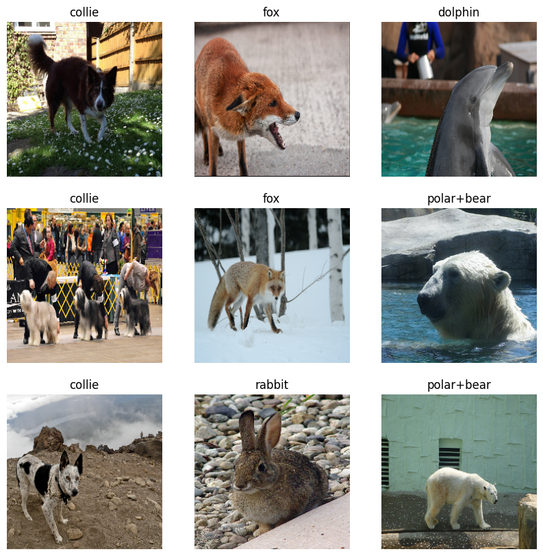
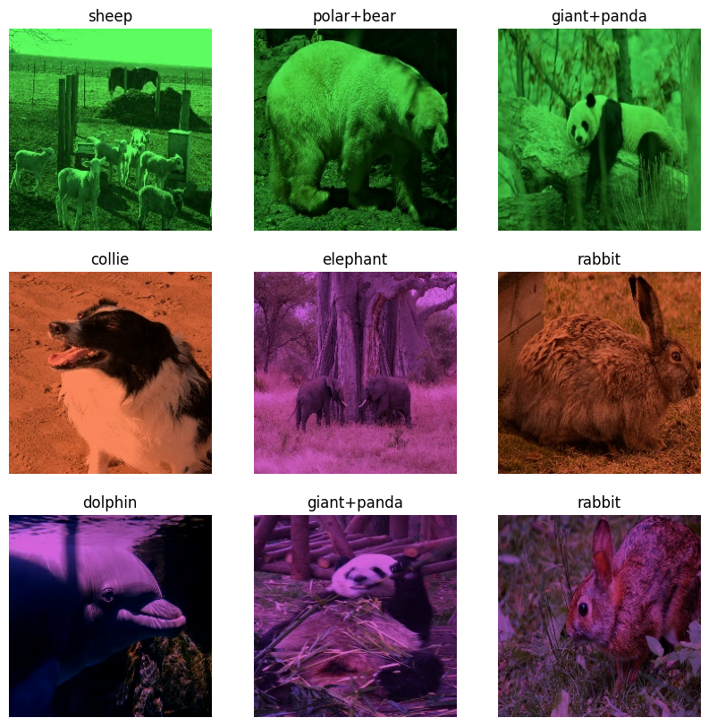

# Global AI Hub Image Processing Bootcamp  

## Table of Contents  
 
0. [Imports and Environment Variables](#0-imports-and-environment-variables)  
1. [Using the Dataset](#1-using-the-dataset)  
2. [Preprocessing the Dataset](#2-preprocessing-the-dataset)  
3. [CNN Model Design](#3-cnn-model-design)  
4. [Evaluating the Dataset](#4-evaluating-the-dataset)  
5. [Manipulating the Test Dataset](#5-manipulating-the-test-dataset)  
6. [Testing Model With Manipulated Dataset](#6-testing-model-with-manipulated-dataset)  
7. [Applying Color Constancy to Manipulated Images](#7-applying-color-constancy-to-manipulated-images)  
8. [Testing Model With Color Constancy Applied Images](#8-testing-model-with-color-constancy-applied-images)  
9. [Comparison of Accuracies and Finale](#9-comparison-of-accuracies-and-finale)  

---

## 0. Imports and Environment Variables  

Essential dependencies include:  
- **TensorFlow/Keras** - Preprocess and augment the dataset, constructing and evaluating the CNN model.  
- **Keras Tuner** - Automated hyperparameter optimization.  
- **OpenCV** - Reading/writing images.  
- **Sklearn** - Dataset partitioning. 
- **os/shutil** - File operations.
- **Matplotlib** - Visualization of results.  

A global random seed is fixed to ensure reproducibility.  

---

## 1. Using the Dataset  

The [dataset](https://www.kaggle.com/datasets/rrebirrth/animals-with-attributes-2) consists of images belonging to 10 classes of animals. Namely collie, dolphin, elephant, fox, moose, rabbit, sheep, squirrel, giant panda and polar bear.
- Main dataset was not balanced so first 650 samples taken from each used class. reducing the risk of bias.  
- Observed that TensorFlow randomness shuffled dataset caused some among the samples could cause train-test datasets to clash. Reducing dataset reliability. Instead used Sklearn train-test split method. Ensuring each train/validation/test class has equal samples.
- Visual inspections and exploratory data analysis confirm the dataset’s integrity. Sklearn method worked better than TensorFlow's.

---

## 2. Preprocessing the Dataset  

Preprocessing aims to condition the dataset for optimal model performance. Key steps include:  
- **Normalization** - Pixel intensities scaled to the [0,1] range.  
- **Resizing** - Image samples resized to (224 x 224) pixels.  
- **Augmentation** - Random flips, rotations, and brightness adjustments for diverse training data. Increasing model robustness.  

Dataset split:  
- **Training** - 70% - 454 each class
- **Validation** - 15% - 98 each class
- **Testing** - 15% - 98 each class

---

## 3. CNN Model Design  

A convolutional neural network (CNN) is architected to classify images.  
Key design components:  
- **Convolutional Blocks** - Extract hierarchical features with convolution layers. Each block is batch normalized to improve generalization. Each block has more kernels from previous, adding capacity for model to learn more abstract features. 
- **Max Pooling** - Dimensionality reduction. Get the dominant features after each convolution operation.
- **Global Average Pooling** - Enhances generalization.  
- **Dense Layers** - Classification with dropout regularization.  

Hyperparameter optimization is conducted using **Keras Tuner**, with **Hyperband** algorithm applied to maximize validation accuracy.  
- Initial tuning yields a validation accuracy of **57.45%**.
- Training with more epochs boosts this to **71.12%** 

---

## 4. Evaluating the Dataset  
Upon completing model training, performance is assessed on the test set.  
- **Test Accuracy** - 71.12%  
- Further manual tuning increases this to **77.63%**. 

---

## 5. Manipulating the Test Dataset  
The test dataset is artificially manipulated to assess the model’s resilience to real-world distortions.  
Techniques applied:  
- **Color Channel Adjustments** - Tests for robustness against hue shifts.  

---

## 6. Testing Model With Manipulated Dataset  
The manipulated dataset is evaluated against the trained model.  
- Post-manipulation accuracy: **20.02%**  
- This dramatic reduction highlights the model's sensitivity to lighting alterations.  

---

## 7. Applying Color Constancy to Manipulated Images  
To mitigate the performance degradation, white balance (Gray World) algorithm has applied.  
- This algorithm corrects for color distortions by recalibrating color channels.  

---

## 8. Testing Model With Color Constancy Applied Images  
Following white balance correction, the model is re-evaluated.  
- Accuracy after correction: **64.29%**  
- This represents a partial recovery, underscoring the potential of preprocessing techniques in improving model robustness.  

---

## 9. Comparison of Accuracies and Finale  

### Model Accuracy Summary  
| **Scenario**                               | **Validation Accuracy** |  
|--------------------------------------------|------------------------|  
| Hyperband tuner search model               | 57.45%                 |  
| Hyperband tuner trained model              | 71.12%                 |  
| Hand-tuned model                           | 77.63%                 |  
| Manipulated with colored lights            | 20.02%                 |  
| Accuracy after reverted colors             | 64.29%                 |  

The project highlights the importance of data preprocessing and model tuning in enhancing CNN performance. Despite significant performance degradation under manipulated datasets, white balance correction restores a considerable portion of the original accuracy.  
